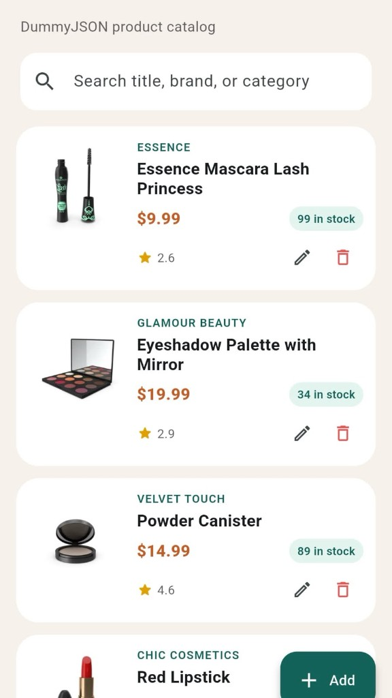
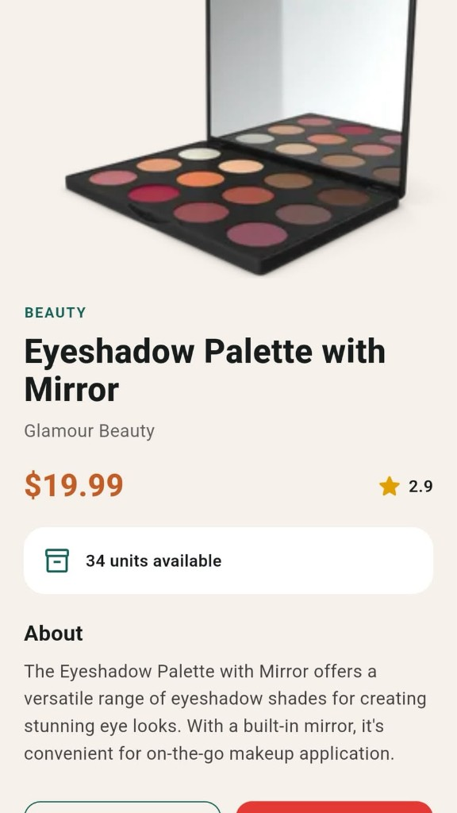
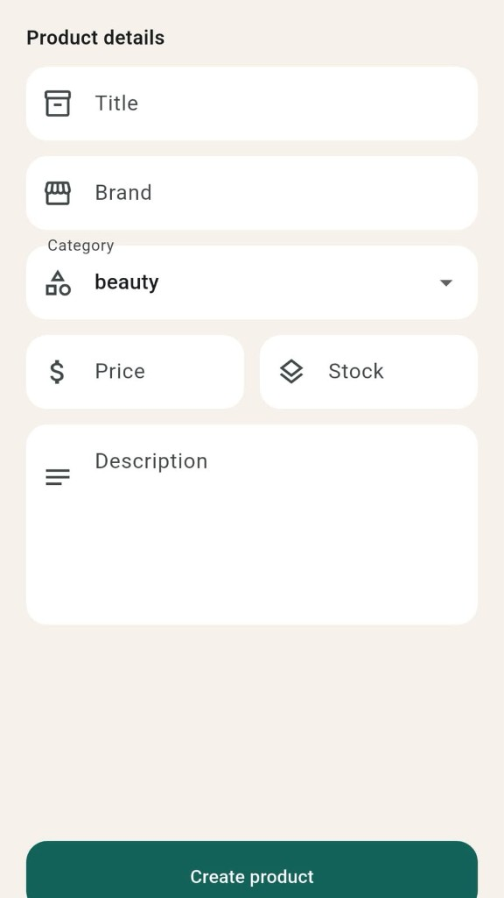
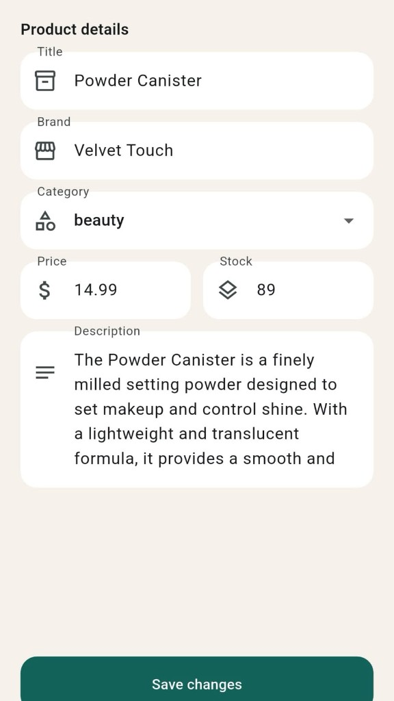

# Shelf

Flutter mobile app for product **CRUD** using the free [DummyJSON](https://dummyjson.com) Products API. No API key required.

## Screenshots

| Home catalog | Product details |
| :---: | :---: |
|  |  |
| **Create product** | **Edit product** |
|  |  |

## Features

- **Read** — load products with images, price, stock, and rating
- **Create** — add a product from the form
- **Update** — edit title, brand, category, price, stock, and description
- **Delete** — remove a product (confirm dialog or swipe)
- Search by title, brand, or category
- Pull to refresh, loading and error states

## API

Base URL: `https://dummyjson.com`

| Action | Method | Endpoint |
| --- | --- | --- |
| List products | `GET` | `/products?limit=24` |
| Create product | `POST` | `/products/add` |
| Update product | `PUT` | `/products/{id}` |
| Delete product | `DELETE` | `/products/{id}` |

DummyJSON simulates writes and does not persist new products on the server. The app still calls the API, then updates the local list so create, edit, and delete appear correctly in the UI.

## Run the app

```bash
flutter pub get
flutter run
```

Requires [Flutter](https://docs.flutter.dev/get-started/install) 3.38+ and a connected device or emulator.

## Project structure

```
lib/
  main.dart
  theme.dart
  models/product.dart
  services/product_api.dart
  screens/home_screen.dart
  screens/product_detail_screen.dart
  screens/product_form_screen.dart
  widgets/product_card.dart
```
